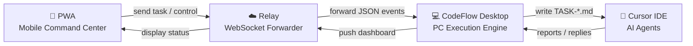
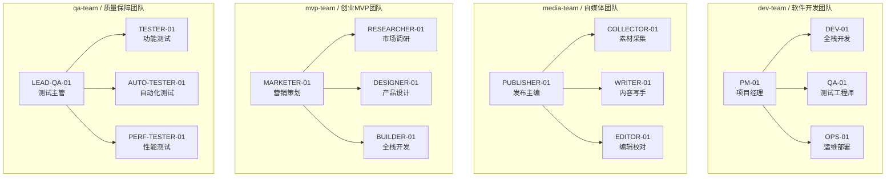

# CodeFlow / 码流

[](LICENSE)
[](https://joinwell52-ai.github.io/codeflow-pwa/)
[](https://github.com/joinwell52-AI/codeflow-pwa/releases)
[](https://joinwell52-ai.github.io/codeflow-pwa/)

> **Commands Flow, Intelligence Follows.**
> 指令成流，智能随行。

**CodeFlow** is an AI-powered human-machine collaboration hub. Command your multi-agent team from a mobile phone; let the PC handle execution.

**码流（CodeFlow）** — AI 驱动的人机协作中枢。手机发指令，PC 写代码；每条消息都落成文件，文件名即通信协议。

<p align="center">
  
  &nbsp;&nbsp;
  
</p>

---

## How It Works / 工作原理



| Layer | Role | Tech |
|-------|------|------|
| **Phone (PWA)** | Command center — send tasks, view status, scan to bind PC | HTML5 PWA, Service Worker |
| **Relay** | Lightweight text event forwarder | WebSocket (`wss://`) |
| **Desktop** | Execution engine — receive tasks, write files, patrol, bridge | Python, PyInstaller EXE |
| **Cursor IDE** | AI agents read/write TASK files, auto-dispatched by Nudger | Cursor + MCP Plugin |

---

## File-Driven Protocol / 文件驱动协议

> **Filename IS the protocol.** No second chat system.
> 文件名就是通信协议，不形成第二套聊天系统。

```
TASK-20260413-001-MARKETER-to-RESEARCHER.md
│    │         │   │          │
│    Date       │   Sender     Recipient
│              Seq#
TASK prefix
```

Every message — whether from human (ADMIN) or AI agent — is persisted as a markdown file with YAML front matter.

| Directory | Content |
|-----------|---------|
| `tasks/` | Task assignments |
| `reports/` | Completion reports |
| `issues/` | Bug / problem records |
| `log/` | Archive & notifications |

---

## Agent Naming & Team Templates / Agent 命名与团队模板

CodeFlow uses a **role-code naming convention**: uppercase English code + numeric suffix.

码流采用 **角色代码命名法**：大写英文代号 + 数字后缀。

### Naming Rules / 命名规则

| Rule | Example | Description |
|------|---------|-------------|
| Human operator | `ADMIN-01` | Always the human; never an AI |
| AI role code | `PM-01`, `DEV-01` | Uppercase, hyphen, 2-digit number |
| Team leader | First role in `codeflow.json` | Receives tasks from ADMIN |
| Task routing | `ADMIN01-to-PM01` | Embedded in filename |

### 4 Built-in Team Templates / 四套内置团队模板

Choose a template during project initialization. Each template generates bilingual role documents (Chinese + English).



| Template | Roles | Use Case |
|----------|-------|----------|
| **dev-team** | PM + DEV + QA + OPS | Software development |
| **media-team** | PUBLISHER + COLLECTOR + WRITER + EDITOR | Content / media |
| **mvp-team** | MARKETER + RESEARCHER + DESIGNER + BUILDER | Startup MVP |
| **qa-team** | LEAD-QA + TESTER + AUTO-TESTER + PERF-TESTER | Quality assurance |

### Example: `codeflow.json` (mvp-team)

```json
{
  "team": "mvp-team",
  "team_name": "创业MVP团队",
  "roles": [
    {"code": "MARKETER",   "label": "营销策划"},
    {"code": "RESEARCHER", "label": "市场调研"},
    {"code": "DESIGNER",   "label": "产品设计"},
    {"code": "BUILDER",    "label": "全栈开发"}
  ],
  "leader": "MARKETER",
  "lang": "zh"
}
```

After initialization, your project directory looks like:

```
your-project/
├── .cursor/
│   ├── rules/          ← collaboration rules (.mdc)
│   └── skills/file-protocol/SKILL.md
├── docs/agents/
│   ├── codeflow.json   ← team config
│   ├── MARKETER-01.md / MARKETER-01.en.md
│   ├── RESEARCHER-01.md / RESEARCHER-01.en.md
│   ├── tasks/    reports/    issues/    log/
```

---

## Quick Start / 快速开始

### Desktop (PC)

```powershell
# Option 1: Run packaged EXE (recommended, ~35MB)
codeflow-desktop\dist\CodeFlow-Desktop.exe

# Option 2: Run from source (Python 3.10+)
cd codeflow-desktop
pip install -r requirements.txt
python main.py
```

**Download / 下载：**
- China (recommended): https://gitee.com/joinwell52/cursor-ai/releases
- GitHub: https://github.com/joinwell52-AI/codeflow-pwa/releases

On first launch, select your project folder. The Desktop opens a local panel at `http://127.0.0.1:18765` and auto-detects Cursor IDE.

### Mobile PWA

Open in mobile browser and add to home screen:

**https://joinwell52-ai.github.io/codeflow-pwa/**

Scan the QR code shown on the Desktop panel to bind your phone to the PC.

**PWA Capabilities:**
- Scan to bind/unbind PC
- Send tasks to any role
- Task list with categories (Tasks / Reports / Issues / Archive)
- View task markdown source
- Team roles synced from PC `codeflow.json`
- Real-time patrol trace display
- Remote desktop control (focus Cursor / start work)

---

## Self-Healing Nudger / 巡检器自愈

The Desktop Nudger continuously monitors Cursor IDE and auto-recovers from common failures:

| Scenario | Action |
|----------|--------|
| Cursor Connection Error | Auto Reload Window |
| Extension Host frozen | Auto Reload Window |
| Agent task stuck/timeout | Reload Window + nudge message |
| Agent waiting for confirmation | Auto-send "continue" |
| WebSocket disconnect | Auto-reconnect (exponential backoff) |
| Relay rate limit | Throttle + retry |

---

## Relay Service / 中继服务

| Environment | URL |
|-------------|-----|
| Local dev | `ws://127.0.0.1:5252` (`python server/relay/server.py`) |
| Production | Gateway proxies `/codeflow/ws/` to relay process |

The relay only forwards JSON text. Limits: `MAX_MESSAGE_BYTES` = 256KB, `TRANSPORT_MAX_BYTES` (WebSocket frame) = 512KB.

---

## Repository Structure / 仓库结构

```
BridgeFlow/
├── README.md
├── CHANGELOG.md
├── codeflow-desktop/          # Desktop source & packaging
│   ├── main.py                # Entry point (v2.9.44)
│   ├── nudger.py              # Patrol + relay client
│   ├── updater.py             # Auto-update (GitHub + Gitee)
│   ├── panel/index.html       # Desktop web panel
│   ├── templates/agents/      # 4 team templates
│   └── build.spec             # PyInstaller config
├── codeflow-plugin/           # Cursor MCP plugin
├── web/pwa/                   # PWA source (v2.2.9)
│   ├── index.html
│   ├── config.js
│   ├── sw.js
│   └── manifest.json
├── server/relay/server.py     # Local relay for dev
├── docs/
│   ├── agents/                # Agent role definitions
│   ├── images/                # Product screenshots
│   └── user-manual.md
└── scripts/                   # Utility scripts
```

---

## Core Principles / 核心原则

- **Filename IS the protocol** — `TASK-...-Sender-to-Recipient.md`
- **Phone sends text & commands only** — does not replace the desktop execution environment
- **PC handles execution** — bridging, patrolling, file I/O, Cursor wake-up
- **Relay forwards JSON only** — single message limit 256KB
- **One message = one file** — no chat-only channel allowed

---

## License

MIT License. See [LICENSE](LICENSE).

© 2026 joinwell52-AI · From real production experience.

- PWA repo: [github.com/joinwell52-AI/codeflow-pwa](https://github.com/joinwell52-AI/codeflow-pwa)
- Version history: [CHANGELOG.md](CHANGELOG.md)
- User manual: [docs/user-manual.md](docs/user-manual.md)
