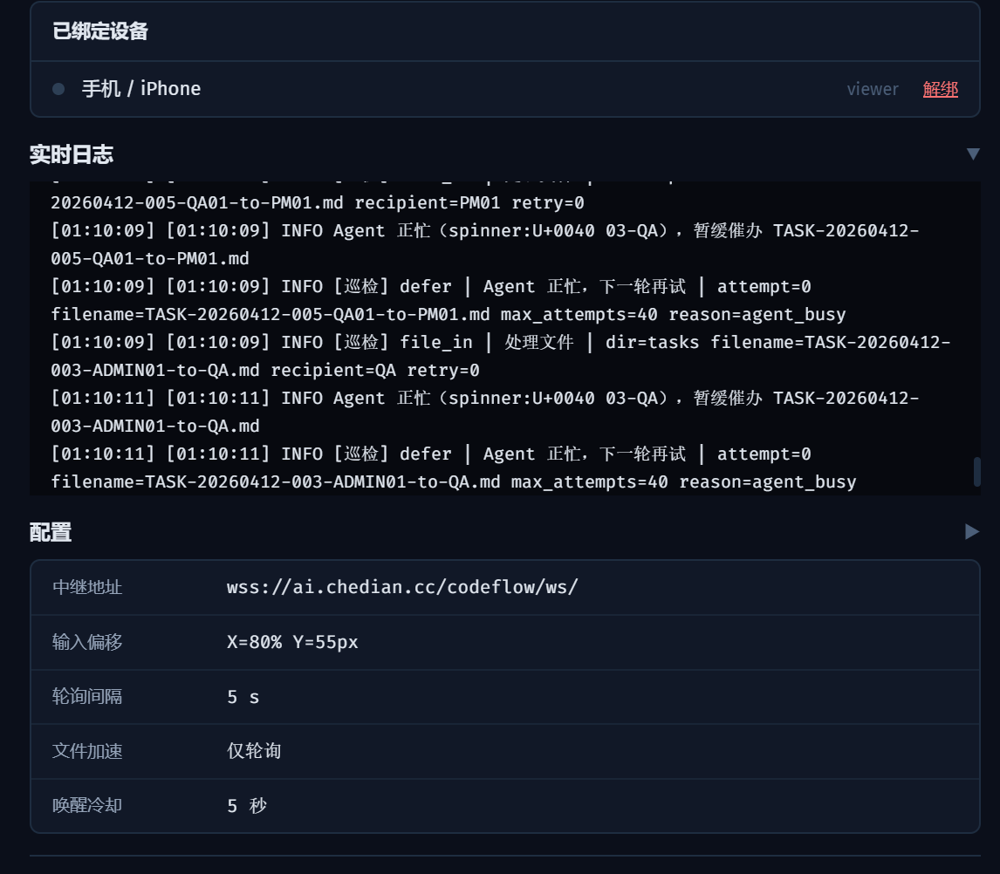
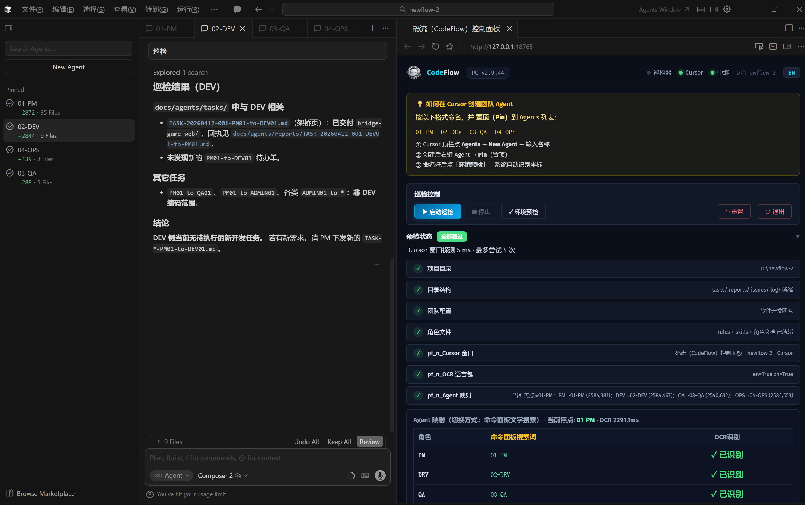
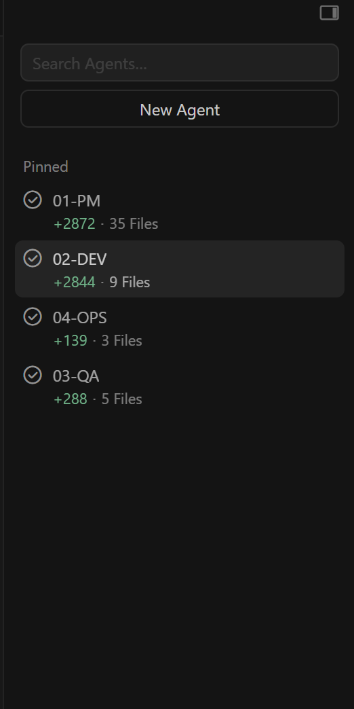
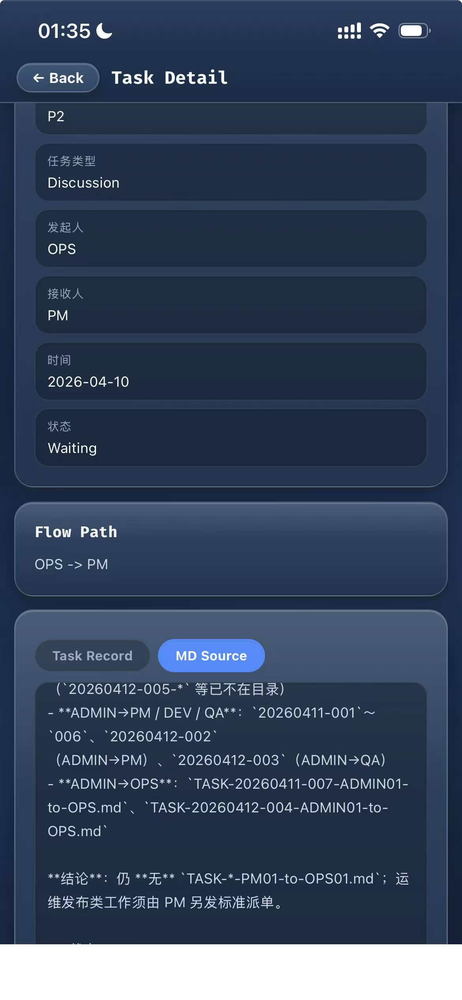
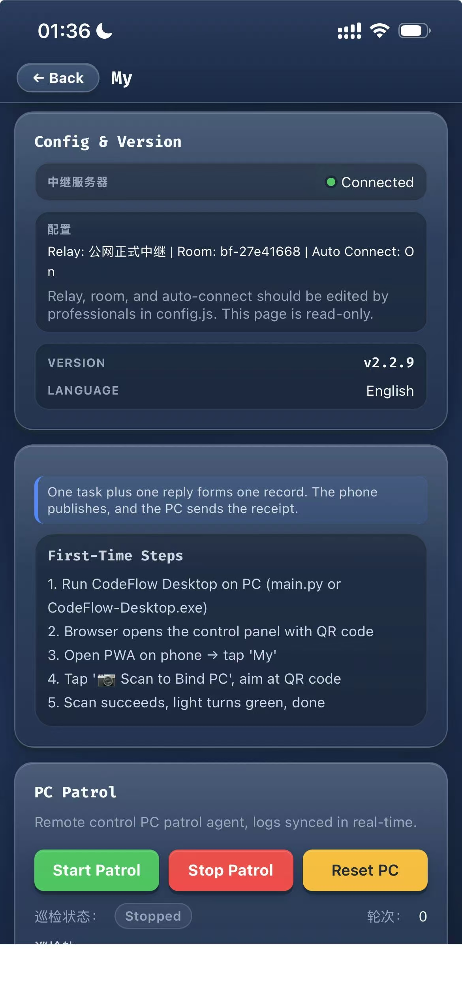

# How to Build an Automated AI Team with Cursor

## 如何在 Cursor 中搭建 AI 自动化团队

> Just tell the PM what you need, go grab a coffee, and come back to review the results.
>
> 你只需要跟 PM 说清楚要做什么，然后去喝杯咖啡，回来验收成果。

[📖 English](README.en.md) | [📖 中文版](README.zh.md)

---

We published the methodology — [**How to Build an Automated AI Development Team in Cursor**](https://joinwell52-ai.github.io/joinwell52/) — and then built the tool to make it real.

我们先发布了方法论 — [**如何在 Cursor 中搭建 AI 自动化开发团队**](https://joinwell52-ai.github.io/joinwell52/) — 然后把它做成了产品。

**CodeFlow** (码流) is the production-ready tool born from that methodology. It turns the "filename as protocol" concept into a complete human-AI collaboration system: mobile command center + PC execution engine + multi-agent coordination.

**码流（CodeFlow）** 就是这套方法论的产品化落地。它把"文件名即协议"的理念变成了完整的人机协作系统：手机主控台 + PC 执行机 + 多角色自动调度。

  
  &nbsp;
  
  &nbsp;
  

---

### From Theory to Tool / 从理论到工具

| | Methodology 方法论 | Product 产品 |
|---|---|---|
| **Repo** | [joinwell52](https://github.com/joinwell52-AI/joinwell52) | [codeflow-pwa](https://github.com/joinwell52-AI/codeflow-pwa) |
| **What** | How to name agents, define roles, route tasks via filenames | Desktop EXE + PWA + Relay + MCP Plugin |
| **Core idea** | `TASK-date-seq-Sender-to-Recipient.md` | Same protocol, automated end-to-end |
| **Roles** | PM / DEV / QA / OPS | 3 team templates (dev / media / mvp) |
| **Human role** | Tell PM what to do | Phone sends task, PC executes |

---

### Screenshots / 产品截图

<b>Desktop Panel / 桌面端控制面板</b>

  
  

  
  

  
  

<b>Cursor IDE — AI Agents at Work / AI Agent 工作中</b>

  

  

  
  

<b>PWA Mobile / 手机端</b>

  
  
  

  
  

---

### Quick Start / 快速开始

**Desktop** — download EXE (~35MB) and double-click:
- China: https://gitee.com/joinwell52/cursor-ai/releases
- GitHub: https://github.com/joinwell52-AI/codeflow-pwa/releases

**PWA** — open on phone and add to home screen:
- https://joinwell52-ai.github.io/codeflow-pwa/

For full documentation, see [English](README.en.md) | [中文](README.zh.md).

---

### License

MIT License. © 2026 joinwell52-AI

- Methodology: [joinwell52-ai.github.io/joinwell52](https://joinwell52-ai.github.io/joinwell52/)
- Product: [github.com/joinwell52-AI/codeflow-pwa](https://github.com/joinwell52-AI/codeflow-pwa)
- Changelog: [CHANGELOG.md](CHANGELOG.md)
