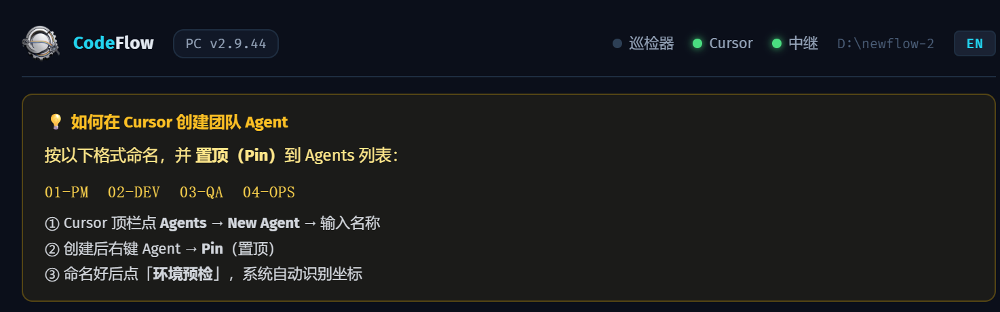

# 码流（CodeFlow）— 指令成流，智能随行

> 把 [Cursor AI 自动化团队方法论](https://joinwell52-ai.github.io/joinwell52/) 变成了一个真正能用的产品。
> 下载、运行，然后用手机指挥你的 AI 团队。

<p align="center">
  
  &nbsp;
  
  &nbsp;
  
</p>

---

## 码流是什么？

码流是你的 **AI 编程团队遥控器**。它把你的手机和运行 Cursor IDE 的电脑连起来，让你能：

- 用手机给 AI 角色派任务
- 实时看他们干活
- 干完了收到报告

不需要搭服务器，不需要注册账号。只需要两样东西：

| 你需要 | 它干什么 |
|--------|---------|
| **码流 Desktop**（EXE） | 在你的 PC 上运行，桥接手机和 Cursor IDE |
| **码流 PWA**（手机网页应用） | 在手机上打开，发任务、看状态 |

---

## 3 分钟上手

### 第一步：下载桌面端 EXE

- **国内（推荐）**：https://gitee.com/joinwell52/cursor-ai/releases
- **GitHub**：https://github.com/joinwell52-AI/codeflow-pwa/releases

双击 `CodeFlow-Desktop.exe`（约 35MB）。首次运行选择你的项目文件夹。

### 第二步：手机打开 PWA

在手机浏览器打开：

**https://joinwell52-ai.github.io/codeflow-pwa/**

点"添加到主屏幕"安装成 App。

### 第三步：扫码绑定

1. 桌面端面板上会显示二维码
2. 在 PWA 里点 **我的** → **扫码绑定 PC**
3. 扫一下二维码 — 搞定！绿灯亮了就是连上了

现在你可以用手机发任务，看 AI 团队干活了。

---

## 工作原理

```
手机（PWA）──→  中继（WebSocket）──→  PC 桌面端  ──→  Cursor IDE
  发任务          转发事件            写文件         AI 角色执行
  看状态    ←──   推送更新      ←──   读取报告  ←──   写回报告
```

每条任务变成一个 Markdown 文件：`TASK-20260413-001-ADMIN01-to-PM01.md`

文件名告诉系统谁发的、发给谁、什么时候。不需要数据库，不需要消息队列 — 只有文件。

---

## 手机上能做什么

| 功能 | 说明 |
|------|------|
| **发任务** | 写内容，选角色（PM/DEV/QA/OPS），发送 |
| **看任务列表** | 分类：任务单 / 报告 / 问题 / 归档 |
| **看任务详情** | 完整 Markdown 原文、流转路径、状态 |
| **监控巡检** | 实时看巡检器在 Cursor 里的动作 |
| **远程控制巡检** | 手机上启动/停止巡检 |
| **团队状态** | 看每个角色是忙碌、空闲还是等待 |
| **中英切换** | 完整的中英文双语界面 |

---

## 你的 AI 团队

码流内置 3 套团队模板，初始化项目时选一套：

| 模板 | 角色 | 适合 |
|------|------|------|
| **dev-team** | PM + DEV + QA + OPS | 软件开发项目 |
| **media-team** | PUBLISHER + COLLECTOR + WRITER + EDITOR | 自媒体内容创作 |
| **mvp-team** | MARKETER + RESEARCHER + DESIGNER + BUILDER | 创业 MVP |

每个角色是一个 Cursor Agent，有独立的规则和职责。桌面端的**巡检器**自动在角色之间切换、派发任务、卡住了还会催。

---

## 自动故障恢复

桌面端持续监控 Cursor IDE，常见问题自动修：

| 问题 | 码流怎么处理 |
|------|-------------|
| Cursor 连接错误 | 自动 Reload Window |
| Extension Host 卡死 | 自动 Reload Window |
| Agent 卡住或超时 | Reload + 发催促消息 |
| Agent 等待确认 | 自动发送"继续" |
| WebSocket 断连 | 自动重连 |

不用盯着 Agent 干活。去喝咖啡吧。

---

## 产品截图

### PC 桌面端控制面板

在你的电脑上运行的控制中心：

<p align="center">
  
</p>
<p align="center">
  
  
</p>
<p align="center">
  
  
</p>
<p align="center">
  
  
</p>

### Cursor IDE — AI Agent 工作中

AI 角色在 Cursor 里工作时的样子：

<p align="center">
  
</p>
<p align="center">
  
</p>
<p align="center">
  
  
</p>

### 手机端 PWA

用手机指挥你的团队：

<p align="center">
  
  
  
</p>
<p align="center">
  
  
</p>

---

## 桌面端面板功能

桌面端会在 `http://127.0.0.1:18765` 打开控制面板，包含：

- 环境预检（项目目录、团队配置、Cursor 窗口、OCR 识别）
- Agent 映射 + 一键切换角色
- 任务流水线 + 文件浏览器（任务单 / 报告 / 问题 / 归档）
- 巡检轨迹实时日志
- 技能市场（下载社区技能包给 Agent 用）
- 二维码供手机扫描绑定
- 自动更新（GitHub + Gitee 双线路，自动选最快的）

---

## 常见问题

**问：需要安装 Python 吗？**
不需要。EXE 是独立打包的，下载双击就能用。

**问：没网能用吗？**
桌面端和 Cursor 在本地工作。手机连接需要中继服务器（默认已配置 `wss://ai.chedian.cc/codeflow/ws/`）。你也可以自己搭中继。

**问：能自定义团队角色吗？**
可以。编辑项目文件夹里的 `docs/agents/codeflow.json`，PWA 会自动同步。

**问：我的数据会发到服务器吗？**
只有任务状态事件（JSON 文本，不含文件内容）经过中继。所有实际文件都在你的 PC 上。中继消息限制 256KB。

---

## 相关链接

- **方法论**：[如何在 Cursor 中搭建 AI 自动化开发团队](https://joinwell52-ai.github.io/joinwell52/)
- **产品主页**：[github.com/joinwell52-AI/codeflow-pwa](https://github.com/joinwell52-AI/codeflow-pwa)
- **PWA 在线**：[joinwell52-ai.github.io/codeflow-pwa](https://joinwell52-ai.github.io/codeflow-pwa/)
- **下载（国内）**：[gitee.com/joinwell52/cursor-ai/releases](https://gitee.com/joinwell52/cursor-ai/releases)
- **下载（GitHub）**：[github.com/joinwell52-AI/codeflow-pwa/releases](https://github.com/joinwell52-AI/codeflow-pwa/releases)
- **更新日志**：[CHANGELOG.md](CHANGELOG.md)

---

MIT License. © 2026 joinwell52-AI
